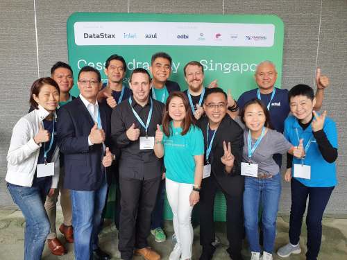
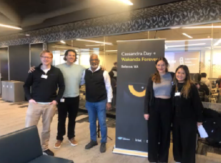
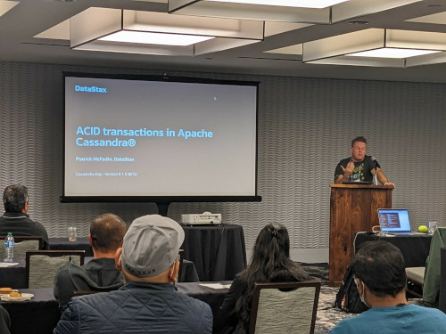
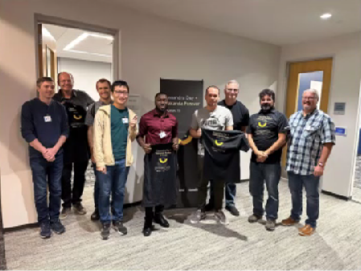
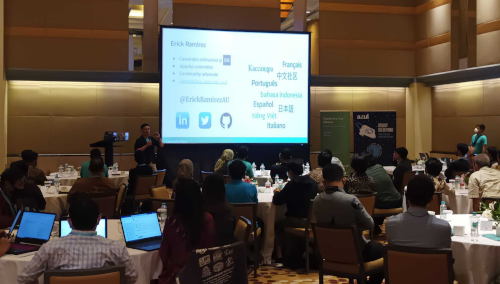
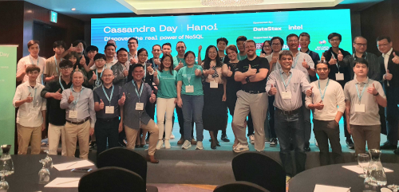
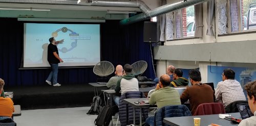
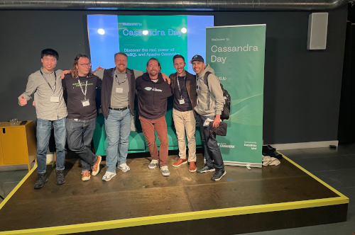
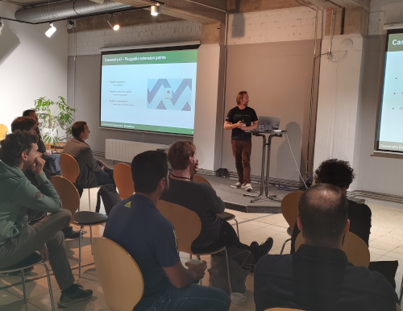

# Cassandra Day Resources

Here you will find slide decks and other
useful material related to the Cassandra Days, the events all about
Apache Cassandra™.

Please attribute if using the following contents further.

## What are the upcoming Cassandra Days?

A good place to check the scheduled future Cassandra Day events
is the Events section on the [Apache Cassandra website](https://cassandra.apache.org/_/events.html).

The upcoming events are also listed in our [Call for Papers](https://dtsx.io/cdays-cfp) form.

## Table of Contents

**Tech talks** by venue:

- [Singapore (November 2022)](#cassandra-day-singapore-november-2022)
- [Bellevue/Seattle (November 2022)](#cassandra-day-bellevueseattle-november-2022)
- [Santa Clara (November 2022)](#cassandra-day-santa-clara-november-2022)
- [Houston (November 2022)](#cassandra-day-houston-november-2022)
- [Jakarta (November 2022)](#cassandra-day-jakarta-november-2022)
- [Hanoi (November 2022)](#cassandra-day-hanoi-november-2022)
- [Amsterdam (October 2022)](#cassandra-day-amsterdam-october-2022)
- [London (October 2022)](#cassandra-day-london-october-2022)
- [Berlin (September 2022)](#cassandra-day-berlin-september-2022)

[**Workshop** slide decks & resources](#hands-on-workshop-resources)

[**Certification** info](#academy--apache-cassandra-certification)

[**Community**](#get-in-touch-get-help)

[Your **Instructors**](#cassandra-day-instructors)

## Tech talk slide decks

_Note: for your convenience, we group the files per venue. To do that, we often duplicate links across venues._

### Cassandra Day Singapore (November 2022)

[Cassandra in a Nutshell](slides/cday_deck_cassandra-in-a-nutshell.pdf) - see also [Github hands-on practice](https://github.com/datastaxdevs/conference-2022-devoxx/blob/main/CASSANDA.MD)

[Future of Cassandra, V2](slides/cday_deck_future-of-cassandra_V2.pdf)

[Intel Contributions to a Faster Cassandra - Intel](slides/cday_deck_Intel-contributions-to-a-faster-cassandra.pdf) - see also ["Partner University" resources](https://partneruniversity.intel.com/learn/course/7000/intel-cloud-solution-architect-csa-tech-talk-workload-spotlight-java-optimizations)

[Cassandra at Lightspeed - Michael Chong, Azul](slides/cday_deck_cassandra-at-lightspeed_-_Michael_Chong_Azul.pdf)

[CDC=true: leveraging Change Data Capture for Cassandra](slides/cday_deck_CDC-equals-true.pdf) - see also [Github demo repo](https://github.com/difli/cdc-to-kafka-for-twitter-sentimentr-up)

[Stargate: an OSS API Layer for Cassandra, V2](slides/cday_deck_stargate-oss-api-layer-for-cassandra_V2.pdf)

### Cassandra Day Bellevue/Seattle (November 2022)

[Stargate: an OSS API Layer for Cassandra, V2](slides/cday_deck_stargate-oss-api-layer-for-cassandra_V2.pdf)

[Cassandra NoSQL for Real-time graph ETL and modern Data Pipelines - ThatDot/Quine](slides/cday_deck_cassandra-for-real-time-graph-ETL_-_ThatDot.pdf)

[ACID Transactions in Apache Cassandra®](slides/cday_deck_acid-transactions-in-cassandra.pdf)

[Intel Contributions to a Faster Cassandra - Intel](slides/cday_deck_Intel-contributions-to-a-faster-cassandra.pdf) - see also ["Partner University" resources](https://partneruniversity.intel.com/learn/course/7000/intel-cloud-solution-architect-csa-tech-talk-workload-spotlight-java-optimizations)

### Cassandra Day Santa Clara (November 2022)

<!-- Apple -->

<!-- Performance Tuning -->

[ACID Transactions in Apache Cassandra®](slides/cday_deck_acid-transactions-in-cassandra.pdf)

### Cassandra Day Houston (November 2022)

<!-- Apple -->

[Cassandra NoSQL for Real-time graph ETL and modern Data Pipelines - ThatDot/Quine](slides/cday_deck_cassandra-for-real-time-graph-ETL_-_ThatDot.pdf)

[ACID Transactions in Apache Cassandra®](slides/cday_deck_acid-transactions-in-cassandra.pdf)

### Cassandra Day Jakarta (November 2022)

[Cassandra in a Nutshell](slides/cday_deck_cassandra-in-a-nutshell.pdf) - see also [Github hands-on practice](https://github.com/datastaxdevs/conference-2022-devoxx/blob/main/CASSANDA.MD)

[Future of Cassandra, V2](slides/cday_deck_future-of-cassandra_V2.pdf)

[Intel Contributions to a Faster Cassandra - Intel](slides/cday_deck_Intel-contributions-to-a-faster-cassandra.pdf) - see also ["Partner University" resources](https://partneruniversity.intel.com/learn/course/7000/intel-cloud-solution-architect-csa-tech-talk-workload-spotlight-java-optimizations)

[Cassandra at Lightspeed - Michael Chong, Azul](slides/cday_deck_cassandra-at-lightspeed_-_Michael_Chong_Azul.pdf)

[CDC=true: leveraging Change Data Capture for Cassandra](slides/cday_deck_CDC-equals-true.pdf) - see also [Github demo repo](https://github.com/difli/cdc-to-kafka-for-twitter-sentimentr-up)

[Stargate: an OSS API Layer for Cassandra, V2](slides/cday_deck_stargate-oss-api-layer-for-cassandra_V2.pdf)

### Cassandra Day Hanoi (November 2022)

[Cassandra in a Nutshell](slides/cday_deck_cassandra-in-a-nutshell.pdf) - see also [Github hands-on practice](https://github.com/datastaxdevs/conference-2022-devoxx/blob/main/CASSANDA.MD)

[Future of Cassandra, V2](slides/cday_deck_future-of-cassandra_V2.pdf)

[Intel Contributions to a Faster Cassandra - Intel](slides/cday_deck_Intel-contributions-to-a-faster-cassandra.pdf) - see also ["Partner University" resources](https://partneruniversity.intel.com/learn/course/7000/intel-cloud-solution-architect-csa-tech-talk-workload-spotlight-java-optimizations)

[CDC=true: leveraging Change Data Capture for Cassandra](slides/cday_deck_CDC-equals-true.pdf) - see also [Github demo repo](https://github.com/difli/cdc-to-kafka-for-twitter-sentimentr-up)

[Stargate: an OSS API Layer for Cassandra, V2](slides/cday_deck_stargate-oss-api-layer-for-cassandra_V2.pdf)

### Cassandra Day Amsterdam (October 2022)

[Automating Cassandra operations with Apache Airflow - Rahul Singh, Anant Corporation](slides/cday_deck_automating-ops-with-airflow_-_Rahul_Singh_Anant.pdf)

[Future of Cassandra](slides/cday_deck_future-of-cassandra.pdf)

[CDC=true: leveraging Change Data Capture for Cassandra](slides/cday_deck_CDC-equals-true.pdf) - see also [Github demo repo](https://github.com/difli/cdc-to-kafka-for-twitter-sentimentr-up)

[Cassandra 4.1 Guardrails](slides/cday_deck_guardrails.pdf)

### Cassandra Day London (October 2022)

[Automating Cassandra operations with Apache Airflow - Rahul Singh, Anant Corporation](slides/cday_deck_automating-ops-with-airflow_-_Rahul_Singh_Anant.pdf)

[Future of Cassandra](slides/cday_deck_future-of-cassandra.pdf)

[5 Pitfalls of a Cassandra Developer](slides/cday_deck_5-pitfalls-of-cassandra-developer.pdf)

[CDC=true: leveraging Change Data Capture for Cassandra](slides/cday_deck_CDC-equals-true.pdf) - see also [Github demo repo](https://github.com/difli/cdc-to-kafka-for-twitter-sentimentr-up)

### Cassandra Day Berlin (September 2022)

[Future of Cassandra](slides/cday_deck_future-of-cassandra.pdf)

[5 Pitfalls of a Cassandra Developer](slides/cday_deck_5-pitfalls-of-cassandra-developer.pdf)

[Stargate: an OSS API Layer for Cassandra](slides/cday_deck_stargate-oss-api-layer-for-cassandra.pdf)

[CDC=true: leveraging Change Data Capture for Cassandra](slides/cday_deck_CDC-equals-true.pdf) - see also [Github demo repo](https://github.com/difli/cdc-to-kafka-for-twitter-sentimentr-up)

## Hands-on workshop resources

[Slide deck for "Cassandra Fundamental" workshop](slides/workshops/cday_workshop_deck_cassandra-fundamentals.pdf)

[Slide deck for "Data Modeling & App Development" workshop](slides/workshops/cday_workshop_deck_data-modeling-and-app-development.pdf)

[Slide deck for "Apache Cassandra® Hands-On Workshop"](slides/workshops/cday_workshop_deck_complete-cassandra-workshop-2h.pdf) (this conflates the two above in a single two-hour session)

#### Full self-contained course repositories:

[Fundamentals](https://github.com/datastaxdevs/workshop-cassandra-fundamentals#readme),
[Data modeling](https://github.com/datastaxdevs/workshop-cassandra-data-modeling#readme),
[App Development](https://github.com/datastaxdevs/workshop-cassandra-application-development#readme)

## Academy & Apache Cassandra™ Certification

**DataStax sponsors your education!**
To boost your Cassandra knowledge, take the FREE courses offered by DataStax
at [academy.datastax.com](https://academy.datastax.com).

Complete either the _Developer Path_ or the _Administrator path_ and take the
certification exam: it'll be a powerful upgrade to your resume!

Note: _participants of Cassandra Days are entitled to a voucher
valid to take the certification exam **for free**
(instead of the $145 exam cost)_

## Get in touch, get help

[Apache Cassandra main website](https://cassandra.apache.org/)

[Official Cassandra Slack](https://s.apache.org/slack-invite)

[Follow "cassandra" on StackOverflow](https://stackoverflow.com/questions/tagged/cassandra)

[Follow "cassandra" on DBA StackExchange](https://dba.stackexchange.com/questions/tagged/cassandra)

[DataStax Developers](https://dtsx.io/discord) on Discord
(questions, support, almost anything Cassandra- and developer-related)

## Cassandra Day instructors

👨🏽‍🏫 [Aleks Volochnev](https://dtsx.io/aleks) - LinkedIn `@aleks-volochnev`, Github `@HadesArchitect`

👨🏽‍🏫 [Cédrick Lunven](https://dtsx.io/cedrick) - Twitter `@clunven`

👨🏽‍🏫 [Stefano Lottini](https://dtsx.io/stefano) - LinkedIn `@stefano-lottini`, Github `@hemidactylus`, Twitter `@rsprrs`

👨🏽‍🏫 Erick Ramirez - Linkedin `@ErickRamirez`, Github `@ErickRamirezAU`, Twitter `@ErickRamirezAU`

👨🏽‍🏫 [Raghavan "Rags" Srinivas](https://dtsx.io/rags) - Linkedin `@rags`, Github `@ragsns`, Twitter `@ragss`

👨🏽‍🏫 Artem Chebotko - Linkedin `@ArtemChebotko`, Github `@ArtemChebotko`

👨🏽‍🏫 Aaron Ploetz - Linkedin `@aaronploetz`, Github `@aploetz`, Twitter `@aploetz`

### Attribution statement

> Apache Cassandra, Cassandra and Apache are either registered trademarks or
> trademarks of the [Apache Software Foundation](http://www.apache.org/)
> in the United States and/or
> other countries, and are [used with permission](http://www.apache.org/foundation/marks/events.html).
> The Apache Software Foundation has no affiliation with and does not
> endorse or review the materials provided at these events,
> which are managed by DataStax.
