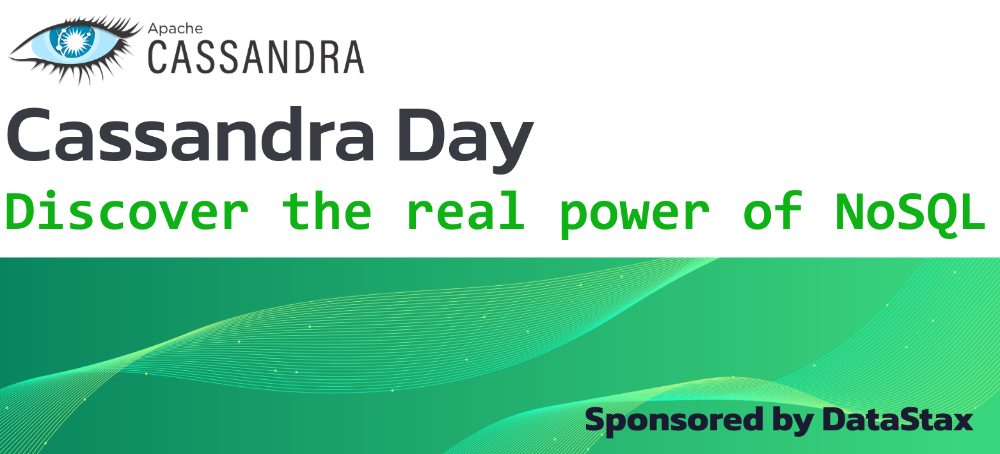

# Cassandra Day Resources

Here you will find slide decks and other
useful material related to the Cassandra Days, the events all about
Apache Cassandra™.

Please attribute if using the following contents further.

## Tech talk slide decks

[Automating Cassandra operations with Apache Airflow - Rahul Singh, Anant Corporation](slides/cday_deck_automating_ops_with_airflow_-_Rahul_Singh_Anant.pdf)

[Future of Cassandra](slides/cday_deck_future-of-cassandra.pdf)

[5 Pitfalls of a Cassandra Developer](slides/cday_deck_5-pitfalls-of-cassandra-developer.pdf)

[Stargate: an OSS API Layer for Cassandra](slides/cday_deck_stargate-oss-api-layer-for-cassandra.pdf)

[CDC=true: leveraging Change Data Capture for Cassandra](slides/cday_deck_CDC-equals-true.pdf)

[Cassandra 4.1 Guardrails](slides/cday_deck_guardrails.pdf)

## Additional tech talk resources

[Github repo for the CDC=true tech talk](https://github.com/difli/cdc-to-kafka-for-twitter-sentimentr-up)

## Hands-on workshop resources

[Slide deck for "Cassandra Fundamental" workshop](slides/workshops/cday_workshop_deck_cassandra-fundamentals.pdf)

[Slide deck for "Data Modeling & App Development" workshop](slides/workshops/cday_workshop_deck_data-modeling-and-app-development.pdf)

[Workshop 2 companion repo](https://dtsx.io/cday-ws2)

Full self-contained course repositories:
[Fundamentals](https://github.com/datastaxdevs/workshop-cassandra-fundamentals#readme),
[Data modeling](https://github.com/datastaxdevs/workshop-cassandra-data-modeling#readme),
[App Development](https://github.com/datastaxdevs/workshop-cassandra-application-development#readme)

## Academy & Apache Cassandra™ Certification

**DataStax sponsors your education!**
To boost your Cassandra knowledge, take the FREE courses offered by DataStax
at [academy.datastax.com](https://academy.datastax.com).

Complete either the _Developer Path_ or the _Administrator path_ and take the
certification exam: it'll be a powerful upgrade to your resume!

Note: _participants of Cassandra Days are entitled to a voucher
valid to take the certification exam **for free**
(instead of the $145 exam cost)_

## Get in touch, get help

[Apache Cassandra main website](https://cassandra.apache.org/)

[Official Cassandra Slack](https://s.apache.org/slack-invite)

[Follow "cassandra" on StackOverflow](https://stackoverflow.com/questions/tagged/cassandra)

[Follow "cassandra" on DBA StackExchange](https://dba.stackexchange.com/questions/tagged/cassandra)

[DataStax Developers](https://dtsx.io/discord) on Discord
(questions, support, almost anything Cassandra- and developer-related)

## Cassandra Day instructors

[Aleks Volochnev](https://dtsx.io/aleks
) - LinkedIn `@aleks-volochnev`, Github `@HadesArchitect`

[Cédrick Lunven](https://dtsx.io/cedrick) - Twitter `@clunven`

[Stefano Lottini](https://dtsx.io/stefano
) - LinkedIn `@stefano-lottini`, Github `@hemidactylus`, Twitter `@rsprrs`

### Attribution statement

> Apache Cassandra, Cassandra and Apache are either registered trademarks or
> trademarks of the [Apache Software Foundation](http://www.apache.org/)
> in the United States and/or
> other countries, and are [used with permission](http://www.apache.org/foundation/marks/events.html).
> The Apache Software Foundation has no affiliation with and does not
> endorse or review the materials provided at this event,
> which is managed by DataStax.

