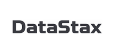

_Note: this is an archived version of the event page._

**Local/Regional Event · In-Person · EMEA**

# Cassandra Day | London

_Discover the real power of NoSQL_

### Date

Oct 11, 2022 | Tue, 9:30 AM - 20:00 PM GMT (UTC+00:00)

### Price

Free

### Location

Huckletree Shoreditch - 14-18 Finsbury Square

## Overview

What do companies like Apple, Netflix, Huawei and Instagram have in common? Aside from billions of requests, petabytes of data, and millions of users around the world, all of these companies use Apache Cassandra™.

[Apache Cassandra](https://cassandra.apache.org/) is an open source NoSQL distributed database trusted by thousands of companies for scalability and high availability without compromising performance. Linear scalability and proven fault-tolerance on commodity hardware or cloud infrastructure make it the perfect platform for mission-critical data.

### Test and Certify

All attendees will be able to claim a free voucher for [DataStax certification for Apache Cassandra™ exam](https://www.datastax.com/dev/certifications)
and $300 credit to use on [Astra DB](https://astra.datastax.com/) - The perfect platform to practice your newly-acquired Cassandra knowledge!

## Agenda

| Time     |                                             |
|----------|---------------------------------------------|
| 9.30am   | Workshop registrations                      |
| 10.00am  | Hands-on workshop: "Cassandra Fundamentals" |
| 11.45am  | Lunch sponsored by Intel                    |
| 12.30pm  | Hands-on workshop: "Cassandra Data Modeling"|
| 14.00pm  | Afternoon registrations                     |
| 15.00pm  | Keynote "Why you should stop using NOSQL" by Aleks Volochnev, IT Exorcist            |
| 15.30pm  | The Future of Cassandra by Mick Semb Wever, Cassandra PMC Member                     |
| 15.55pm  | Five Pitfalls of Cassandra developers and how to avoid them, by Stefano Lottini      |
| 16.20pm  | Break                                       |
| 16.30pm  | Automating Cassandra operations with Apache Airflow - Rahul Singh, Anant Corporation |
| 17.00pm  | Adopting a Cassandra GraphQL API at Yelp - Mark Surnin, Yelp                         |
| 17.30pm  | cdc=true - Leveraging Change Data Capture (CDC) in Cassandra, by Amarjit Basra       |
| 18.00pm  | Quiz, Prizes, Food & Drinks                 |

## Sponsors

## Support

### Contributions

Cassandra Days are meant to help building and strengthening local communities around Open Source Cassandra. That does not only mean that everyone is invited to participate - contributions are very welcome! [Click here to submit to our Call For Papers](https://dtsx.io/cdays-cfp).

### Attributions & Policy

Apache Cassandra, Cassandra and Apache are either registered trademarks or trademarks of the [Apache Software Foundation](http://www.apache.org/)
in the United States and/or other countries,
and are [used with permission](http://www.apache.org/foundation/marks/events.html).
The Apache Software Foundation has no affiliation with and does not endorse or review the materials provided at this event, which is managed by DataStax.

### Anti-harassment Policy

_DataStax is dedicated to a harassment-free experience for everyone. Our anti-harassment policy can be found [here](https://dtsx.io/cdays-anti-harassment-policy)._
