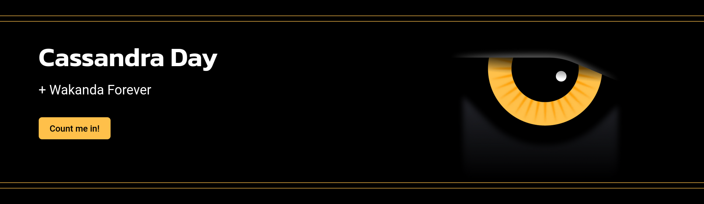

_Note: this is an archived version of the event page._

# Cassandra Day | Wakanda Forever

_An action-packed day of superhero events through group learning, sharing and fun!_

### Date

November 10, 2022

### Location

Bellevue, Santa Clara and Houston

## Overview

Calling all Apache Cassandra® heroes! Join us for a complimentary two-hour hands-on workshop to learn Cassandra application building skills. We’ll help you get skilled up quickly, and every participant will receive a voucher to take the Cassandra certification test at a later date.

Then we celebrate the return of in-person Cassandra meetups with speakers from top companies with lots of food/drink and time to network. And let’s have some fun with t-shirts and prizes!

Finally we will end the day with an exclusive private screening of Black Panther: Wakanda Forever (hours before the world premier) — a Cassandra appreciation event sponsored by DataStax and Intel! It’s a perfect opportunity to flex on your friends your superhero status with this early access event!

Please note that you must attend the Cassandra Day hands-on workshop and/or meetup in order to receive a movie ticket and popcorn/soda vouchers for you and your guest.

Don’t wait - we expect this event to “sell out” quickly. Pick your location in our event registration drop down: **Santa Clara, CA, Bellevue, WA or Houston, TX**. Event venue details will be shared in the confirmation email.

## Agenda

General agenda (see next sections for venue-specific details)

| Time           |                                              |
|-------------------------|----------------------------------------------|
|            | Hands-on Workshop (optional)                 |
| 12-1 pm    | Check-in for Hands-on Workshop + Lunch       |
| 1-3 pm     | Hands-on Workshop: Building data-driven applications with NoSQL and Apache Cassandra® (details below) |
| 3-3:30 pm  | Break/Meet-up Check-in (snacks/drinks)       |
| 3-3:30 pm  | Break/Meet-up Check-in (snacks/drinks)       |
| 3-5:30 pm  | **Cassandra Day Meetup** (Featured speakers vary by city but include Apple, Netflix, Intel, DataStax and others)       |
| 5:30-6 pm  | Break/Meet-up Check-in (snacks/drinks)       |
| 6-6:30 pm  | Travel to the movie theatre and meet up with your +1 (grab popcorn and soda - find a seat!) **Black Panther: Wakanda Forever** movie starts at 6:30 pm sharp! (*) |
|            | (*)Santa Clara only: The movie will begin at 7 pm    |

### Meetup agenda

#### Santa Clara

| Talk  | Speaker |
|-------|---------|
| Cassandra Performance Tuning Tricks, Tips, and Tools | Jon Haddad, _Senior Database Solutions Engineer, Netflix_ |
| Apache Cassandra in 2022: What To Expect from 4.1 and Beyond | Scott Andreas, _Cassandra Storage, Apple_ |
| ACID transactions in Apache Cassandra® | Patrick McFadin, _Apache Cassandra® and Developer Relations, DataStax_ |
| Intel’s contributions to a faster Cassandra | Smita Kamath, _Software Engineer, Intel_ |

#### Bellevue

| Talk  | Speaker |
|-------|---------|
| Apache Cassandra in 2022: What To Expect from 4.1 and Beyond | Jeff Jirsa, _Manager, Apple_ |
| Quine case-study session: Cassandra NoSQL for Real-time graph ETL and modern Data Pipelines | Ryan Wright, _CEO and Founder, thatDot_ |
| ACID transactions in Apache Cassandra® | Raghavan Srinivas, _Cloud Developer Advocate, DataStax_ |
| Intel’s contributions to a faster Cassandra | Justin Long, _Cloud Technologist Intel_ |

#### Houston

| Talk  | Speaker |
|-------|---------|
| Quine case-study session: Cassandra NoSQL for Real-time graph ETL and modern Data Pipelines, _Michael Aglietti | Director of Developer Relations, thatDot_ |
| Stargate - An OSS API Layer for Apache | Ryan Welford, _Developer Advocate, DataStax_ |
| ACID transactions in Apache Cassandra® | Artem Chebotko, _Solutions Architect, DataStax_ |

### Workshop "Building data-driven applications with NoSQL and Apache Cassandra®"

**Getting started with Apache Cassandra®:**

- The most scalable NoSQL database 💽
- Data distribution, replication and consistency 📊 🧐
- 👨‍💻 👩‍💻 Hands-on Lab: Create a Cassandra database instance in the cloud

**Data definition and manipulation using CQL shell:**

- Table definition and partitioning 📈
- Inserts, bulk loading, querying capabilities 💻
- 👨‍💻 👩‍💻 Hands-on Lab: Create, populate and query Cassandra tables

**Application development in Java and Python:**

- Cassandra drivers 🚗
- Data APIs 📲
- 👨‍💻 👩‍💻 Hands-on Lab: Create a Java or Python app to query a Cassandra database

**Next steps on your Cassandra journey:**

- Learning resources ✏️
- Community and getting help 👥

## Community co-sponsor

## Support

### Contributions

Cassandra Days are meant to help build and strengthen local developer communities around Open Source Cassandra. Your contributions are welcome! Click here to submit a [Call For Papers](https://dtsx.io/cdays-cfp) request.
We'd love for you to share your Cassandra success with others.

### Attributions & Policy

Apache Cassandra, Cassandra and Apache are either registered trademarks or trademarks of the [Apache Software Foundation](http://www.apache.org/)
in the United States and/or other countries,
and are [used with permission](http://www.apache.org/foundation/marks/events.html).
The Apache Software Foundation has no affiliation with and does not endorse or review the materials provided at this event, which is managed by DataStax.

### Anti-harassment Policy

_DataStax is dedicated to a harassment-free experience for everyone. Our anti-harassment policy can be found [here](https://dtsx.io/cdays-anti-harassment-policy)._
